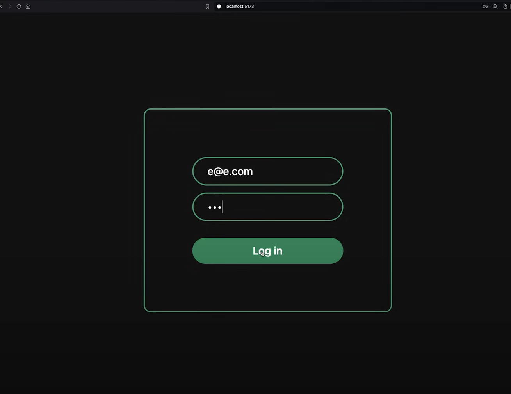
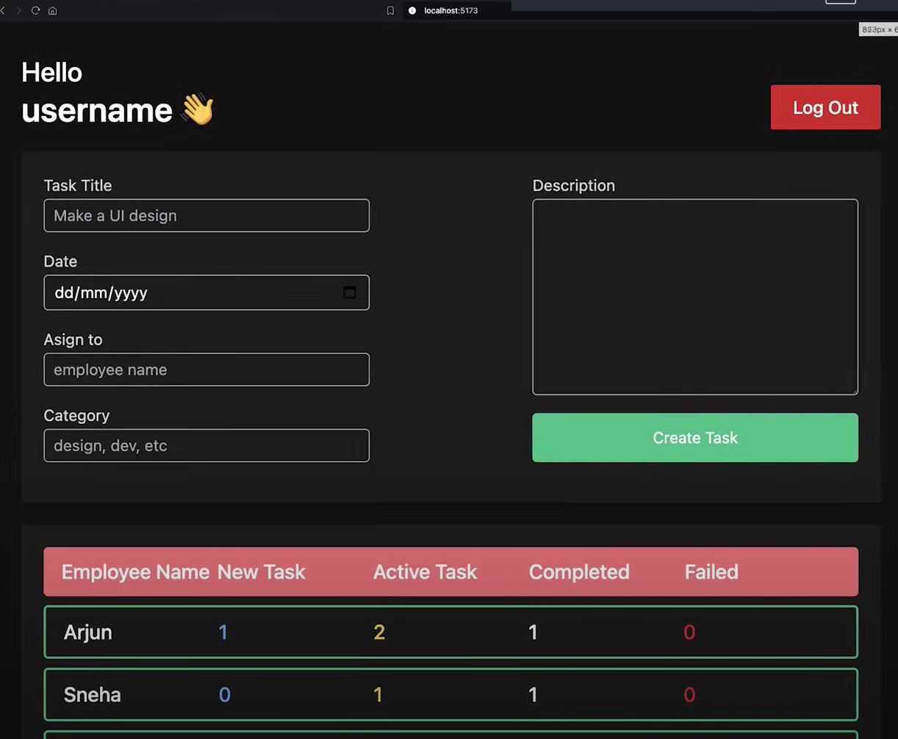
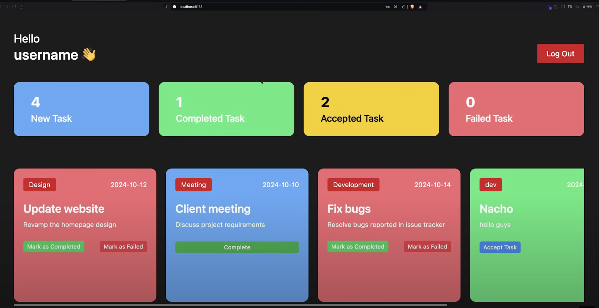

#  Team Task Manager

A role-based task management web application built using **React.js** and **Tailwind CSS**. This app allows Admins to manage employee tasks and Employees to view their assigned tasks in a clean, intuitive interface.

---

##  Features

-  Role-based Login (Admin & Employee)
-  Admin Dashboard:
  - View all employees
  - Assign and manage tasks
-  Employee Dashboard:
  - View personal task list
-  Local Storage based authentication
-  Styled with Tailwind CSS
-  Fully responsive UI

---

##  Tech Stack

| Tech            | Usage                          |
|-----------------|--------------------------------|
| **React.js**    | Frontend library               |
| **Tailwind CSS**| UI Styling                     |
| **Context API** | Global state management        |
| **LocalStorage**| Session management             |

---
## Screenshots

 

 

 
 

# React + Vite

This template provides a minimal setup to get React working in Vite with HMR and some ESLint rules.

Currently, two official plugins are available:

- [@vitejs/plugin-react](https://github.com/vitejs/vite-plugin-react/blob/main/packages/plugin-react/README.md) uses [Babel](https://babeljs.io/) for Fast Refresh
- [@vitejs/plugin-react-swc](https://github.com/vitejs/vite-plugin-react-swc) uses [SWC](https://swc.rs/) for Fast Refresh
